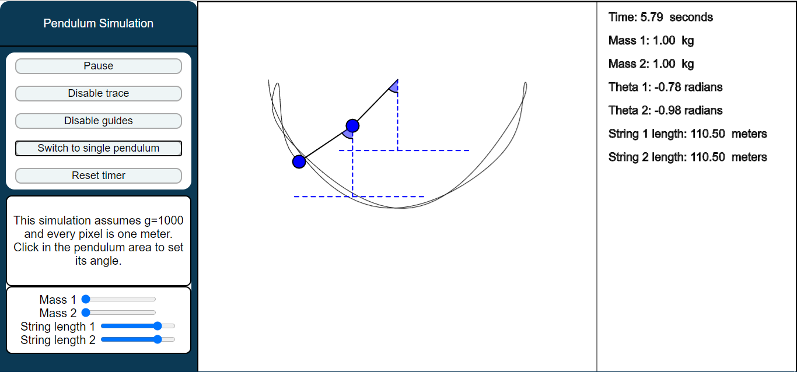

# pendulumSim

A javascript pendulum simulation with p5.js for [sambrunacini.com](http://sambrunacini.com/)
The latest released version is available live in the browser on [plotter.sambrunacini.com](http://plotter.sambrunacini.com/PendulumSimulation/)

The simulation supports arbitrary amplitude single and double pendulums.

Screenshots:

